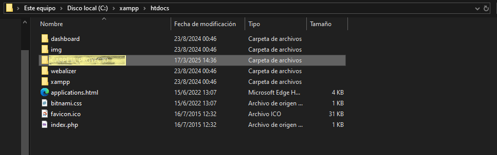
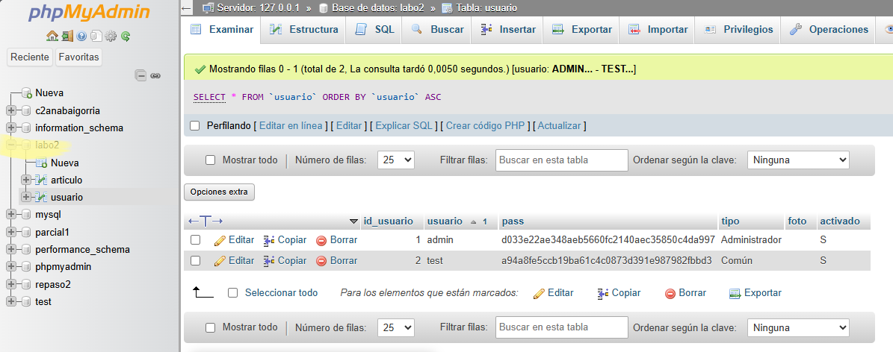

# Sitio web con PHP y bases de datos con MYSQL

_Realizado como trabajo práctico para la asignatura "Laboratorio de software II" de la Universidad Nacional de Tucumán_

_En el archivo 'ACTIVIDAD.pdf' se pueden visualizar los enunciados de las actividades realizadas en cada enlace correspondiente al número de ejercicio del sitio._ **NOTA: Las carpetas del tipo "Ejercicio_XX" pertenecen a los enunciados correspondientes a la parte del TP06.**

## Tecnologías Utilizadas 🛠️

**PHP** para el código fuente y **MARIA DB** (derivado de MySql) para la creación y gestión de la base de datos.

## Pre-requisitos 📋

* Necesitas un editor de código para poder visualizar y/o editar el código fuente

```
Por ejemplo: Visual Studio Code o Bloc de notas
```

* También necesitamos alguna herramienta de software para interactuar con la base de datos.  

```
Personalmente recomiendo phpmyadmin, ya que es gratuita y escrita en PHP, además de que permite manejar la administración vía Web
```

⬇

Para poder utilizarla, debemos instalar **XAMPP** a través de su [sitio web](). (Recomiendo instalar el programa dentro del disco C:)


## Uso 💻

### ¿Cómo visualizarlo en vivo?

* Primero accederemos a la carpeta de **XAMPP** a través del explorador de archivos, la ubicación del mismo va a depender de cúal sea la ubicación dada al momento de la instalación del mismo. Una vez ubicada la carpeta, acceder a **xampp>htdocs** y allí colocar la carpeta del proyecto (llamada **CARPETA_PROYECTO**), como se muestra en la siguiente imagen.



* Luego debemos importar el archivo **labo2.sql** en el sitio web de phpmyadmin. Para ello debemos abrir XAMPP, y encender (apretando el botón de **start**) tanto **Apache** como **MySql** como se muestra en la siguiente captura:


* Ahora ingresaremos a algún navegador como Google Chrome o Microsoft edge y colocaremos en la barra de búsqueda lo siguiente: 'https://localhost/phpmyadmin'

* Una vez allí hacemos click en "Nueva"


* Colocarle como nombre a la Base de Datos "labo2" y elegir cotejamiento **utf-8_general_ci**. Luego presionar Crear


* Ahora solo queda escribir en la barra de búsqueda la ruta del proyecto 'http://localhost//CARPETA_PROYECTO/index.php' y ya podremos visualizarlo e utilizarlo funcionalmente.


_Usarios disponibles: admin (TIPO: administrador; CONTRASEÑA: admin)  / test (TIPO: común; CONTRASEÑA: test)_

### ¿Cómo acceder a la base de datos?

* Ingresaremos a algún navegador como Google Chrome o Microsoft edge y colocaremos en la barra de búsqueda: 'https://localhost/phpmyadmin'

* En la barra lateral podremos ver la base de datos con el nombre "labo2" y sólo debemos hacer click sobre ella para acceder.



## Autor/es ✒️

* **Ana Paula Baigorria** - *Desarrollo completo* - [anitabaigorria](https://github.com/anitabaigorria)


## Licencia 📄

Este proyecto está bajo la Licencia (MIT LICENSE) - mira el archivo [LICENSE.md](LICENSE.txt) para detalles
